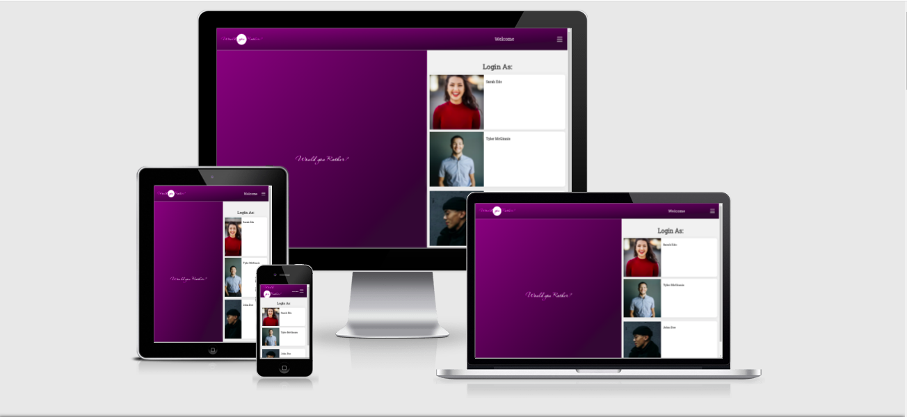

# Would You Rather Project
In the "Would You Rather?" Project, I build a web app that lets a user play the “Would You Rather?” game. The game goes like this: A user is asked a question in the form: “Would you rather [option A] or [option B] ?”. Answering "neither" or "both" is against the rules.

In this app, users will be able to answer questions, see which questions they haven’t answered, see how other people have voted, post questions, and see the ranking of users on the leaderboard.

## Screenshot :camera:

## Built with :heart:
- React & Redux

## Live Link :link: :rocket:
 [Would You Rather](http://would-you-ratha.s3-website-us-east-1.amazonaws.com/)

## Set up :wrench:
- [ ] Clone the repo using the git command <code> git clone git@github.com:Haroonabdulrazaq/would-you-rather.git</code>
- [ ] cd into the project directory <code> cd would-you-rather </code>
- [ ] To start the project <code> npm start </code>

## Tools :hammer_and_wrench:
- React js
- Redux
- AWS (For deployment)

## Work Done
- [] Add Login functionality
- [] Add Logout functionality
- [] Display User information when LoggedIn
- [] Users Unanswered is shown by default
- [] User can toggle between Answered and Unanswered
- [] Add Question detail page
- [] User can Add new Question(Poll)
- [] Add Leaderboard functionality
- [] Add Error or 404 page

## App Functionality
The person using your application should have a way of impersonating/logging in as an existing user. (This could be as simple as having a login box that appears at the root of the application that lets the user select a name from the list of existing users. Alternatively, you could create your own account creation process to allow a user to sign up for an account.) Your application should work correctly regardless of which user is selected. Once the user logs in, the home page should be shown.

We always want to make sure we know who the logged in user is, so information about the logged in user should appear on the page. If someone tries to navigate anywhere by entering the address in the address bar, the user is asked to sign in and then the requested page is shown. The application allows the user to log out and log back in.

Once the user logs in, the user should be able to toggle between his/her answered and unanswered polls on the home page, which is located at the root. The polls in both categories are arranged from the most recently created (top) to the least recently created (bottom). The unanswered questions should be shown by default, and the name of the logged in user should be visible on the page.

What would be the point of seeing answered and unanswered polling questions if we couldn’t actually vote or see the results? Each polling question should link to the details of that poll. The details of each poll should be available at questions/:question_id.

When a poll is clicked on the home page, the following is shown:

Text “Would You Rather”;
Avatar of the user who posted the polling question; and
Two options.
For answered polls, each of the two options contains the following:

Text of the option;
Number of people who voted for that option; and
Percentage of people who voted for that option.
The option selected by the logged-in user should be clearly marked.

Since we want to make sure our application creates a good user experience, the application should show a 404 page if the user is trying to access a poll that does not exist. (Please keep in mind that newly created polls will not be accessible at their url because of the way the backend is set up in this application.) It should also display a navigation bar so that the user can easily navigate anywhere in the application.

So what happens when someone votes in a poll? Upon voting in a poll, all of the information of an answered poll should be displayed. The user’s response should be recorded and clearly visible on the poll details page. Users can only vote once per poll; they shouldn’t be allowed to change their answer after they’ve voted -- no cheating allowed! When the user comes back to the home page, the polling question should appear in the “Answered” column.

It would be no fun to vote in polls if we couldn’t post our own questions! The form for posting new polling questions should be available at the /add route. The application should show the text “Would You Rather” and have a form for creating two options. Upon submitting the form, a new poll should be created, the user should be taken to the home page, and the new polling question should appear in the correct category on the home page.

But how can we know how many questions each user has asked and answered? Let’s get some healthy competition going here! The application should have a leaderboard that’s available at the /leaderboard route. Each entry on the leaderboard should contain the following:

User’s name;
User’s picture;
Number of questions the user asked; and
Number of questions the user answered
Users should be ordered in descending order based on the sum of the number of questions they’ve asked and the number of questions they’ve answered. The more questions you ask and answer, the higher up you move.

The user should be able to navigate to the leaderboard, to a specific question, and to the form that allows the user to create a new poll both from within the app and by typing in the address into the address bar. To make sure we’re showing the data that is relevant to the user, the application should require the user to be signed in order to access those pages

 ## Deploy :rocket:
This project is deployed to [Amazon AWS]()

## Author :man:

👤 **Haroon Abdulrazaq**

- Github: [@githubhandle](https://github.com/Haroonabdulrazaq)
- Twitter: [@twitterhandle](https://twitter.com/hanq_o)
- Linkedin: [linkedin](https://www.linkedin.com/in/haroonabdulrazaq)
- Portfolio: [Portfolio](https://www.haroonabdulrazaq.tech)

## Show your support

Give a ⭐️ if you like this project!

## Acknowledgments
- [MDN](https://udacity.com)

## 📝 License

This project is [MIT](lic.url) licensed.

This is the starter code for the final assessment project for Udacity's React & Redux course.

The `_DATA.js` file represents a fake database and methods that let you access the data. The only thing you need to edit in the ` _DATA.js` file is the value of `avatarURL`. Each user should have an avatar, so you’ll need to add the path to each user’s avatar.

Using the provided starter code, you'll build a React/Redux front end for the application. We recommend using the [Create React App](https://github.com/facebook/create-react-app) to bootstrap the project.

## Data

There are two types of objects stored in our database:

* Users
* Questions

### Users

Users include:

| Attribute    | Type             | Description           |
|-----------------|------------------|-------------------         |
| id                 | String           | The user’s unique identifier |
| name          | String           | The user’s first name  and last name |
| avatarURL  | String           | The path to the image file |
| questions | Array | A list of ids of the polling questions this user created|
| answers      | Object         |  The object's keys are the ids of each question this user answered. The value of each key is the answer the user selected. It can be either `'optionOne'` or `'optionTwo'` since each question has two options.

### Questions

Questions include:

| Attribute | Type | Description |
|-----------------|------------------|-------------------|
| id                  | String | The question’s unique identifier |
| author        | String | The author’s unique identifier |
| timestamp | String | The time when the question was created|
| optionOne | Object | The first voting option|
| optionTwo | Object | The second voting option|

### Voting Options

Voting options are attached to questions. They include:

| Attribute | Type | Description |
|-----------------|------------------|-------------------|
| votes             | Array | A list that contains the id of each user who voted for that option|
| text                | String | The text of the option |

Your code will talk to the database via 4 methods:

* `_getUsers()`
* `_getQuestions()`
* `_saveQuestion(question)`
* `_saveQuestionAnswer(object)`

1) `_getUsers()` Method

*Description*: Get all of the existing users from the database.  
*Return Value*: Object where the key is the user’s id and the value is the user object.

2) `_getQuestions()` Method

*Description*: Get all of the existing questions from the database.  
*Return Value*: Object where the key is the question’s id and the value is the question object.

3) `_saveQuestion(question)` Method

*Description*: Save the polling question in the database.  
*Parameters*:  Object that includes the following properties: `author`, `optionOneText`, and `optionTwoText`. More details about these properties:

| Attribute | Type | Description |
|-----------------|------------------|-------------------|
| author | String | The id of the user who posted the question|
| optionOneText| String | The text of the first option |
| optionTwoText | String | The text of the second option |

*Return Value*:  An object that has the following properties: `id`, `author`, `optionOne`, `optionTwo`, `timestamp`. More details about these properties:

| Attribute | Type | Description |
|-----------------|------------------|-------------------|
| id | String | The id of the question that was posted|
| author | String | The id of the user who posted the question|
| optionOne | Object | The object has a text property and a votes property, which stores an array of the ids of the users who voted for that option|
| optionTwo | Object | The object has a text property and a votes property, which stores an array of the ids of the users who voted for that option|
|timestamp|String | The time when the question was created|

4) `_saveQuestionAnswer(object)` Method

*Description*: Save the answer to a particular polling question in the database.
*Parameters*: Object that contains the following properties: `authedUser`, `qid`, and `answer`. More details about these properties:

| Attribute | Type | Description |
|-----------------|------------------|-------------------|
| authedUser | String | The id of the user who answered the question|
| qid | String | The id of the question that was answered|
| answer | String | The option the user selected. The value should be either `"optionOne"` or `"optionTwo"`|

## Contributing

This repository is the starter code for *all* Udacity students. Therefore, we most likely will not accept pull requests. For details, check out [CONTRIBUTING.md](https://github.com/udacity/reactnd-project-would-you-rather-starter/blob/master/CONTRIBUTING.md).
